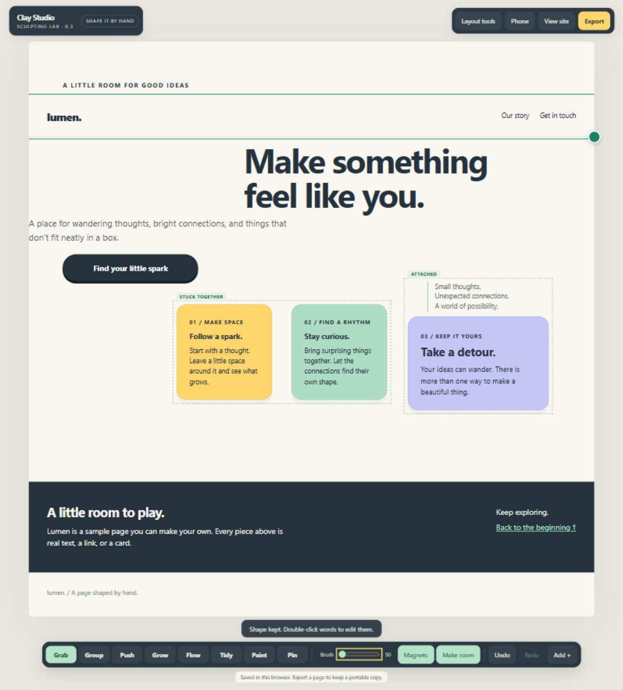

# Clay Studio · Sculpting Lab 0.3

Shape a real webpage by hand: grab a piece, push a brush through the layout, grow cards, or draw a path for them to follow. The editor uses geometry, DOM measurements, and CSS. No AI service or account is required.

## Run locally

Install Python 3 if it is not already available, then double-click `START-CLAY.cmd` on Windows. Open **http://127.0.0.1:8920/index.html** while the server window is running.

On any platform, run this from the project folder:

```sh
python serve.py
```

An optional port argument is supported: `python serve.py 8921`. The server listens on this computer only. Python's standard library is sufficient; there are no packages to install.

## Try it

1. **Grab** a card or the header/footer. Pull the green corner to resize. Full-width regions can move vertically; narrow them to make room for sideways movement.
2. Turn on **Magnets**, then drag the small caption near a card edge. Release when the attachment hint appears. The two pieces now move together. Hold **Shift** for free placement.
3. Choose **Group** and drag a box or draw a loop around at least two piece centers. Grab any member to move the group, or stretch its corner.
4. With a group selected, choose **Peel a piece** and pull a member at least 56 pixels to release it. **Ungroup** releases every member in place. Undo restores the relationship.
5. Try **Push**, **Grow**, **Flow**, **Tidy**, **Paint**, and **Pin**. Grow upward to enlarge and downward to shrink. Tidy eases nearby rows and excessive gaps. Pin holds a piece or group still.
6. Double-click words to edit them. Use **Add +** for text, cards, buttons, images, or more canvas.
7. Choose **Phone** to inspect the stacked layout, **View site** to use the actual links, or **Export** to save a standalone page.

**Make room** moves neighboring pieces aside where space permits. Text and cards retain minimum dimensions. Crowded layouts can still run out of room; the editor reports that explicitly. Groups are handled as rectangular units, including the space between members.

The navigation, story section, and footer can all be grabbed in Sculpt. Their internal contents remain part of each region; Layout tools provide finer structural controls. In Layout tools, the pieces on the canvas can be selected and styled, and their contents rearranged; the pieces themselves are placed in Sculpt.

## Save and share

Completed edits autosave in this browser for this local address. A different port or browser has a separate saved workspace. Use **Export → Save HTML file → Download HTML** for a portable copy. The local server also places saved pages in `exports/`.

Exported pages contain real HTML and CSS and work without Python, the editor, or a network connection. Groups keep their members together in the phone reading order. `examples/grouped-page.html` is a browser-verified export.

**For an agent** exports a text description of the changes and group membership alongside the HTML/CSS options. This is a handoff aid; it is not a live agent connection or an AI feature.

## Keyboard controls

| Action | Key |
| --- | --- |
| Grab / Group | G / B |
| Push / Grow | U / R |
| Flow / Tidy | F / S |
| Paint / Pin | P / N |
| Undo / Redo | Ctrl+Z / Ctrl+Shift+Z or Ctrl+Y |
| Nudge selected piece | Arrow keys; Shift for larger steps |
| Delete selected piece | Delete; Undo restores it |
| Cancel stroke / clear selection | Escape |
| Free placement | Hold Shift while dragging |
| Peel a group member | Peel button, or Alt-drag |

Sculpting is intended for a desktop-width viewport. The phone view is a responsive preview, not a touch editing mode.

## Development

Plain JavaScript, CSS, HTML, and a small Python preview/export server. No build step. Node.js is only needed to run the development checks:

```sh
npm test
npm run check
```

- `studio.js`: original layout editor plus the bridge used by Sculpt, undo, persistence, and export.
- `sculpt-core.js`: pure geometry and constraint functions.
- `relations.js`: real DOM grouping, attachment, peeling, and group resizing.
- `sculpt.js` / `sculpt-ui.css`: direct manipulation controls and feedback.
- `index.html`: sculptable example page; `classic.html`: original layout editor example.
- `qa/`: geometry and relationship regression checks.

See `VERIFICATION.txt` for tested behavior and current limits. This is a single-page prototype. Mobile touch editing, multi-page project management, and arbitrary-site import are not provided.

## Repository

A private prototype repository. Source, regression checks, example export, evidence, and launch instructions are included. Runtime exports and local caches are ignored. No license has been chosen yet, so all rights are reserved.


